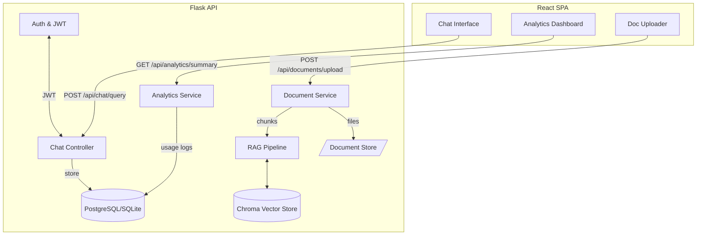

# Notion RAG Chatbot Workspace

Developer-focused retrieval-augmented generation (RAG) workspace with account-based chat history, document ingestion, analytics, and a modern React interface.

## Highlights

- **Authentication & History** — JWT-secured API with per-user chat sessions and persisted transcripts.
- **Vector Search Pipeline** — LangChain + Chroma store, query rewriting, relevance grading, and top-3 source citations with confidence.
- **Document Ingestion** — Upload PDF/Markdown files, auto-chunk/encode, and track ingest metrics.
- **Rate Limiting & Usage Tracking** — Flask-Limiter throttling plus per-endpoint telemetry for analytics.
- **Modern UI** — Vite + React + Tailwind UI with responsive layouts, framer-motion micro-interactions, and engineer-friendly ergonomics.

## Architecture



## Project Structure

```
backend/
  app.py                 # Flask app factory
  config.py              # Runtime configuration & defaults
  extensions.py          # Shared Flask extensions (db, jwt, limiter, cors)
  models.py              # SQLAlchemy models (User, ChatSession, ChatMessage, UploadedDocument, UsageLog)
  routes/                # Modular blueprints
    auth.py              # /api/auth/login, /register, /me
    chat.py              # /api/chat/query, /history
    documents.py         # /api/documents/upload, list ingest metadata
    analytics.py         # /api/analytics/summary
  rag/                   # RAG engine components
    pipeline.py          # RAGPipeline (rewrite → retrieve → grade → answer)
    ingestion.py         # Upload parsing, chunking, hashing utilities
    answerer.py          # LLM answer generator (Anthropic by default)
    grader.py            # Context relevance grader
    rewriter.py          # Query rewriting helper
    prompts.py           # Prompt templates
    notion.py            # Optional Notion sync utilities
  security.py            # Password hashing helpers

frontend/
  package.json           # React/Vite dependencies & scripts
  src/
    App.tsx              # SPA routes with protected layout
    api/client.ts        # Axios client with JWT injection
    components/
      ChatPanel.tsx      # Chat UI with source citations & animations
      Dashboard.tsx      # Usage analytics and session summaries
      AuthProvider.tsx   # Context provider for auth state
      Layout.tsx         # Shell with responsive navigation
      MessageBubble.tsx  # Message rendering + metadata
      SourceList.tsx     # Source confidence cards
    hooks/useChat.ts     # Chat session state + REST integrations
    pages/               # Route-level views (Login, Chat, Dashboard, Upload)
    styles/global.css    # Tailwind base + theme overrides
storage/
  uploads/               # Persisted raw document uploads
  vectorstore/           # Chroma persistent index
requirements.txt         # Python deps
```

## Backend Setup

```bash
python -m venv .venv
source .venv/bin/activate  # Windows: .venv\Scripts\activate
pip install -r requirements.txt

export FLASK_APP=backend.app:create_app
export FLASK_ENV=development
# set JWT_SECRET_KEY, ANTHROPIC_API_KEY, etc.
flask run
```

Configuration is driven by environment variables:

| Variable | Purpose | Default |
| --- | --- | --- |
| `DATABASE_URL` | SQLAlchemy database URL | `sqlite:///instance/app.db` |
| `JWT_SECRET_KEY` | Token signing secret | `change-me` |
| `RATE_LIMIT` | Global limiter per user/IP | `60/minute` |
| `VECTOR_STORE_FOLDER` | Persistent Chroma path | `storage/vectorstore` |
| `UPLOAD_FOLDER` | Raw document storage | `storage/uploads` |
| `EMBEDDING_MODEL_NAME` | Sentence embedding model | `sentence-transformers/all-MiniLM-L6-v2` |
| `FRONTEND_ORIGINS` | Allowed CORS origins | `http://localhost:5173` |
| `ANTHROPIC_API_KEY` | Required Anthropic API key | _none_ |
| `NOTION_TOKEN` | Optional Notion sync token | _none_ |

> ℹ️ The database is auto-created on first boot; switch `DATABASE_URL` to PostgreSQL in production.

## API Reference

| Method & Path | Description |
| --- | --- |
| `POST /api/auth/register` | `{ email, password } → { access_token, user }` |
| `POST /api/auth/login` | `{ email, password } → { access_token, user }` |
| `GET /api/auth/me` | Returns authenticated user |
| `POST /api/chat/query` | `{ message, session_id? } → answer, sources, latency` |
| `GET /api/chat/history` | Returns sessions with nested messages |
| `POST /api/documents/upload` | Multipart upload (PDF/Markdown/TXT) |
| `GET /api/documents` | List uploaded documents + chunk counts |
| `GET /api/analytics/summary` | Usage totals, averages, 7-day call trend |

Responses include the top 3 ranked sources with confidence (0–1.0) and content snippets for rapid triage.

## Frontend Setup

```bash
cd frontend
npm install
npm run dev   # launches on http://localhost:5173
```

The React SPA expects the backend on `http://localhost:5000` (override with `VITE_API_BASE_URL`).

### Notable Components

- `src/components/ChatPanel.tsx` — Live chat window with source callouts, latency badges, and smooth scrolling.
- `src/components/Dashboard.tsx` — Analytics cards, recent session rollup, and usage timeline.
- `src/hooks/useChat.ts` — Centralized session store, history loader, and message dispatcher.

## Adding Your Own Documents

1. Navigate to the **Upload Docs** tab in the UI.
2. Drop a PDF or Markdown file; the backend will:
   - extract text (PyPDF2 / Markdown parser),
   - chunk it with LangChain's `RecursiveCharacterTextSplitter`,
   - embed and persist the vectors in Chroma,
   - log ingestion metrics and expose them via analytics.
3. Uploaded docs become searchable immediately; revisit the chat to query against the new knowledge.

Alternatively, use the API directly:

```bash
curl -X POST http://localhost:5000/api/documents/upload \
  -H "Authorization: Bearer <token>" \
  -F "file=@/path/to/doc.pdf"
```

## Rate Limiting & Monitoring

- `Flask-Limiter` enforces the `RATE_LIMIT` policy across auth/chat/upload endpoints.
- Each API hit records a `UsageLog` row (latency, endpoint, timestamp) feeding the dashboard.
- Average response time, total calls, and last-7-day breakdown are exposed via `/api/analytics/summary`.

## Developer Notes

- Vector store persistence lives in `storage/vectorstore`; delete to rebuild from scratch.
- `backend/rag/notion.py` contains helpers to sync Notion pages if `NOTION_TOKEN` is set — integrate as needed.
- For production, run the API behind `gunicorn`/`uvicorn` and host the Vite build output (`npm run build`).
- Extend the `User` model or attach role metadata for multi-tenant scenarios; rate limits can also be per-plan.

Happy building! Contributions and follow-up refinements are welcome.

