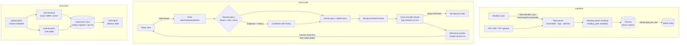

# Obsidian RAG chatbot

[](https://github.com/louisslnn/Notion_RAG_chatbot/actions/workflows/ci.yml)

A retrieval-augmented chatbot over a personal Obsidian vault. The distinctive
part is not the chat: it is the **evaluation harness**. Every retrieval feature
(hybrid search, cross-encoder reranking, conditional query rewriting) is a
configuration flag, and its impact is measured on a hand-validated gold set
before it is adopted — the ablation table below is the project's actual
decision record, not an afterthought.

Flask + LangChain + Chroma backend, React/Vite frontend, streaming answers
over SSE, strict per-user isolation end to end.

## Demo


Citations name the note and heading a chunk came from, and link straight back
into Obsidian (`obsidian://open?...`):


## Evaluation & ablations

The harness ([methodology in `evals/README.md`](evals/README.md)) has three parts:

1. a gold set of factual, multi-note and negative questions — LLM-drafted,
   then **validated line by line by a human** before use;
2. a retrieval-only eval (recall@1/3/5, MRR, nDCG@5) that runs without any
   LLM call, so ablations are free and fast;
3. an end-to-end eval where an LLM judge scores answer coverage and
   faithfulness against the full retrieved chunks, plus refusal accuracy on
   negative questions.

Every run writes `evals/runs/{timestamp}_{git-sha}.json` with the complete
pipeline configuration, so each number in the table is attributable to an
exact commit and flag set. The table is the verbatim output of
`flask rag eval-report --type retrieval` over the committed runs:

<!--
ABLATION TABLE — regenerate after syncing the vault and validating the gold set:

  uv run flask --app backend.app rag eval-retrieval --goldset evals/goldset.jsonl --user <email> --no-hybrid --no-rerank
  uv run flask --app backend.app rag eval-retrieval --goldset evals/goldset.jsonl --user <email> --hybrid    --no-rerank
  uv run flask --app backend.app rag eval-retrieval --goldset evals/goldset.jsonl --user <email> --no-hybrid --rerank
  uv run flask --app backend.app rag eval-retrieval --goldset evals/goldset.jsonl --user <email> --hybrid    --rerank
  uv run flask --app backend.app rag eval-report --type retrieval

Paste the markdown table here, then commit the run files together with the README
so the numbers stay verifiable. Follow with 3-4 sentences of analysis: which
component contributes what, at what latency cost.
-->

> **Status:** the ablation runs are executed against a private vault and are
> committed to `evals/runs/` alongside this table. Until those runs land, no
> numbers are shown here — every figure in this README must be reproducible
> from a committed run file.

## Architecture


```mermaid
flowchart TB
    subgraph Ingestion
        Vault[Obsidian vault] -->|flask obsidian sync<br>hash-based incremental| Parser[Note parser<br>frontmatter · tags · wikilinks]
        Uploads[PDF / MD / TXT uploads] --> Parser
        Parser --> Chunker[Heading-aware chunking<br>heading_path metadata]
        Chunker --> Chroma[(Chroma<br>dense vectors)]
        Chroma -.->|rebuilt lazily per user| BM25[(BM25 index)]
    end

    subgraph Query path
        UI[React chat] -->|SSE stream| API[Flask /api/chat/query/stream]
        API --> Rewriter{Rewrite policy<br>always / auto / never}
        Rewriter -->|anaphoric + history| Condense[Condense with history]
        Rewriter --> Retrieve
        Condense --> Retrieve[Dense top-k + BM25 top-k]
        Retrieve --> RRF[Reciprocal Rank Fusion]
        RRF --> Rerank[Cross-encoder rerank<br>bge-reranker-v2-m3]
        Rerank -->|below threshold| Refuse[No relevant notes]
        Rerank --> Answer[Streaming answer<br>claude-sonnet-4-6]
        Answer -->|sources event first,<br>then token deltas| UI
    end

    subgraph Evaluation
        Gold[goldset.jsonl<br>human-validated] --> EvalR[eval-retrieval<br>recall / MRR / nDCG]
        Gold --> EvalA[eval-answers<br>LLM judge]
        EvalR & EvalA --> Runs[(evals/runs/*.json<br>config snapshot + git sha)]
        Runs --> Report[eval-report<br>ablation table]
    end
```

## Design decisions

- **Heading-aware chunking.** Markdown is split along its heading structure
  instead of a fixed character window; each chunk carries a `heading_path`
  ("Architecture > Backend"). Chunks align with how notes are actually
  organized, and citations can point at a section rather than a file.
- **RRF rather than learned score weighting.** Dense and BM25 scores live on
  incomparable scales; Reciprocal Rank Fusion only uses ranks, has one
  well-studied constant (k=60), and needs no training data — the right
  trade-off at this corpus size.
- **Rerank threshold instead of an LLM relevance grader.** The original
  binary LLM grader cost one API call per query and returned an opaque
  yes/no. A sigmoid-normalized cross-encoder score with a configurable
  threshold is free of API cost, continuous, and inspectable in the eval runs.
- **BM25 rebuilt from Chroma, not persisted.** Chroma stays the single source
  of truth; per-user BM25 indexes are rebuilt lazily after any
  ingestion/deletion. Rebuild cost is milliseconds at personal-vault scale,
  and an entire class of stale-index bugs disappears.
- **Per-user isolation at every layer.** Chunks carry a `user_id` enforced at
  ingestion, dense search filters on it, BM25 indexes are per user, and the
  regression test proves two users can never retrieve each other's notes.
- **Hash-based incremental sync.** Each note's content hash is tracked in
  SQL together with its chunk ids; unchanged notes are skipped without any
  embedding call, modified notes replace exactly their old chunks, deleted
  notes are purged. Re-syncing an unchanged vault is near-instant.

## Quickstart

```sh
cp .env.example .env          # set JWT_SECRET_KEY and ANTHROPIC_API_KEY
docker compose up --build     # backend on :8000, frontend on :5173
# then sync your vault:
docker compose exec backend flask --app backend.app obsidian sync \
    --vault /path/to/vault --user you@example.com
```

Local development without Docker, full API reference, CLI commands and every
environment variable: see [`docs/architecture.md`](docs/architecture.md).

## Limitations and future work

- **Faithfulness is LLM-judged.** The judge sees the full retrieved chunks
  (not truncated snippets), but it remains a model grading a model; scores
  are comparative signals across runs, not absolute truths.
- **Single-user gold set.** The gold set is built from one vault; results
  quantify component impact on that corpus, not general-domain performance.
- **Graph-aware retrieval is the natural next step.** Wikilink targets are
  already extracted and stored per chunk (`outlinks`); expanding retrieval
  along the note graph is measurable with the existing harness.
- **Cross-encoder latency.** Reranking runs on CPU and adds measurable
  latency per query; the ablation table is the place to judge whether the
  quality gain pays for it.

## License

MIT — see [LICENSE](LICENSE).
